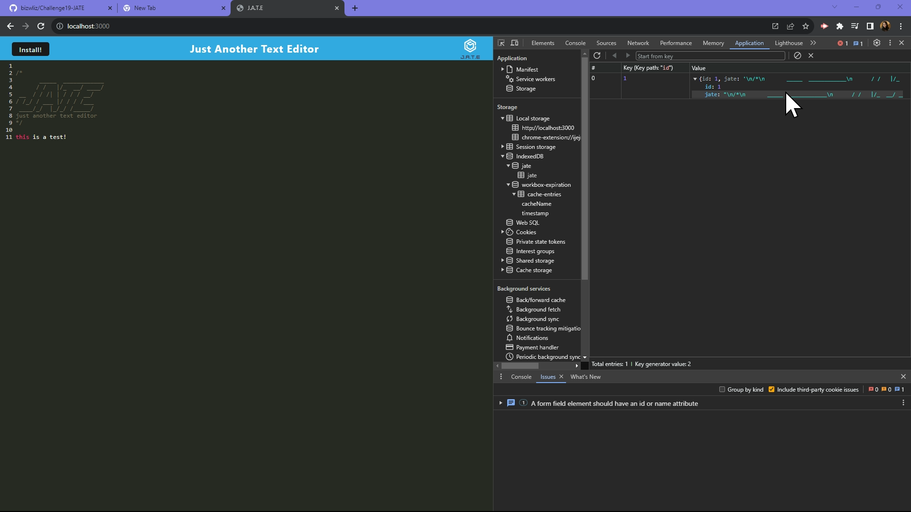

# challenge19-JATE Text Editor

## Description
In this challenge I will be demonstrating my knowledge on PWA's and recreating a simple text editor with a header UI. I will be completing all functions/logic and making sure that when the install button has been clicked, the app prmpts a box on the screen asking the user if they would like to use JATE as an app. I will also be making sure the information is stored properly to the DB.  

## Installation
<ol>
    <li>Create Repository on Github</li>
    <li>Clone Repository to Computer and open in VS Code</li>
    <li>Install Node Modules</li>
    <li>Fill out missing logic (plugins, modules, functions)</li>
    <li>Make sure information is being stored to the DB</li>
    <li>Test out functionality on port 3000</li>
    <li>Create README.md</li>
    <li>Deploy link using Render</li>
    <li>Submit Github link and Deployed link</li>
</ol>

## Usage

Link to github: <a href="https://github.com/bizwliz/Challenge19-JATE">Challenge 19 JATE Text Editor</a>

</a>

## License
 

## Tests
Tested using VS Code.
Tested Using Insomia.